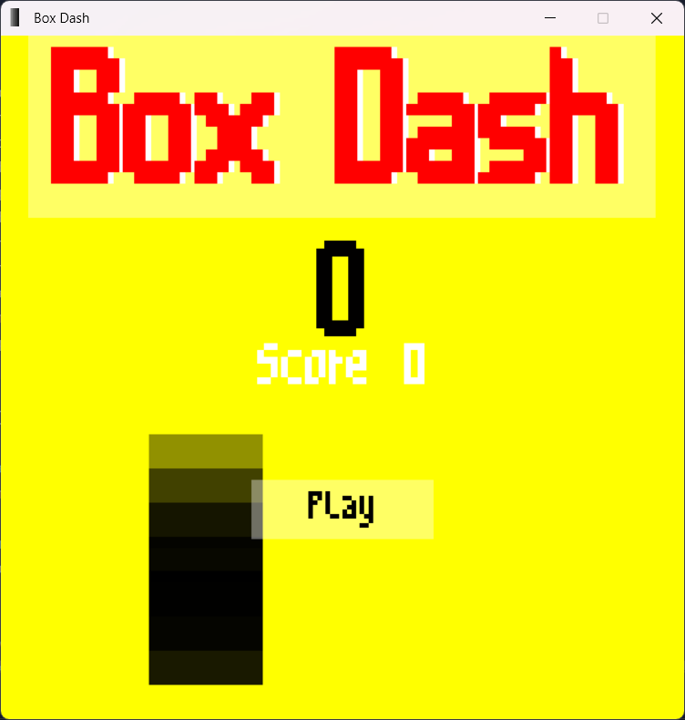
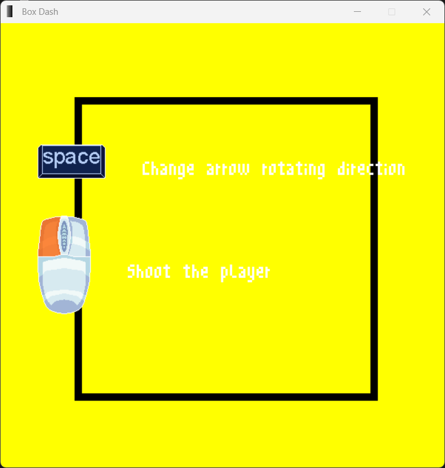
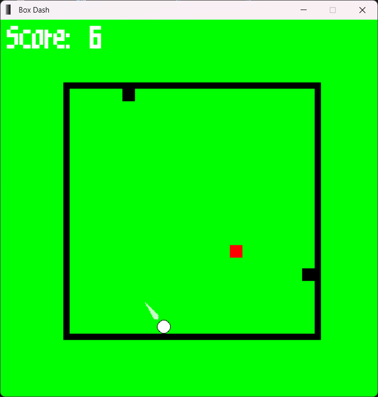
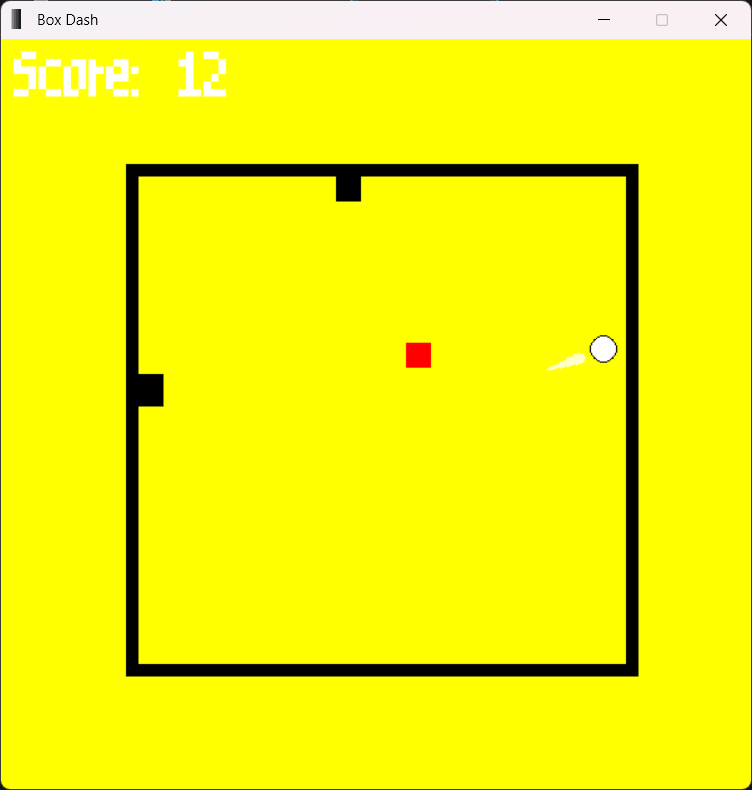
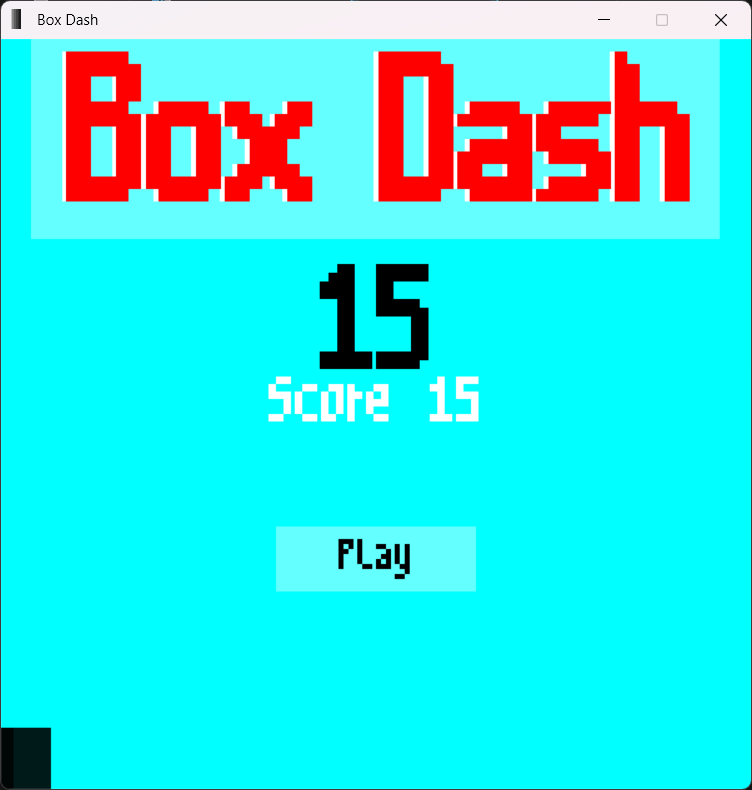

# Box Dash

## 1. Introduction

Box Dash is a 2D arcade-style game developed using Python and Pygame. The player controls a box that must avoid enemies
and obstacles while scoring points. The game is designed to be simple, fast-paced, and fun, with clean visuals and
responsive controls.

---
## 2. Screenshots







---
## 3. Packages Used

- **pygame**: Used to create game loops, draw elements on screen, handle input, and manage collision.

---
## 4. Features of the Game

- Smooth movement mechanics and controls
- Enemy AI with path-following behavior
- Custom bitmap font rendering system
- Screen shake effect and camera system for immersive experience
- Pixel-perfect collision detection
- Game over and score tracking system

---
## 5. How to Set Up the Project from GitHub

### Step 1: Clone the Repository

```bash
git clone https://github.com/your-username/box-dash.git
cd box-dash
```

### Step 2: Set Up a Virtual Environment (Optional but Recommended)

```bash
python -m venv venv
```

Activate the virtual environment:

- **Windows:**
  ```bash
  venv\Scripts\activate
  ```
- **Linux/Mac:**
  ```bash
  source venv/bin/activate
  ```

### Step 3: Install Requirements

```bash
pip install -r requirements.txt
```

### Step 4: Run the Game

```bash
python main.py
```

---
## 6. Future Scope

- Add power-ups and new enemy types
- Create multiple levels with increasing difficulty
- Implement a leaderboard to store high scores
- Add sound effects and background music
- Mobile support with touch controls
- Save/load functionality for persistent scores

---
## 7. Conclusion

Box Dash is a fun and fast-paced arcade game built using Python and Pygame. It serves as a great beginner to
intermediate project for learning game development fundamentals including game loops, input handling, collision
detection, and more. Contributions and feedback are always welcome!